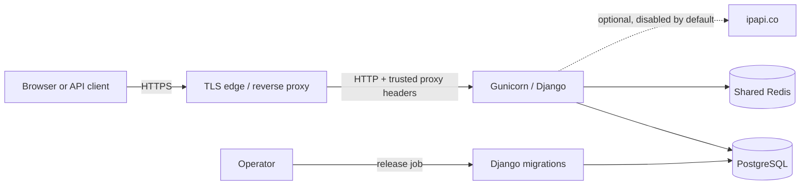
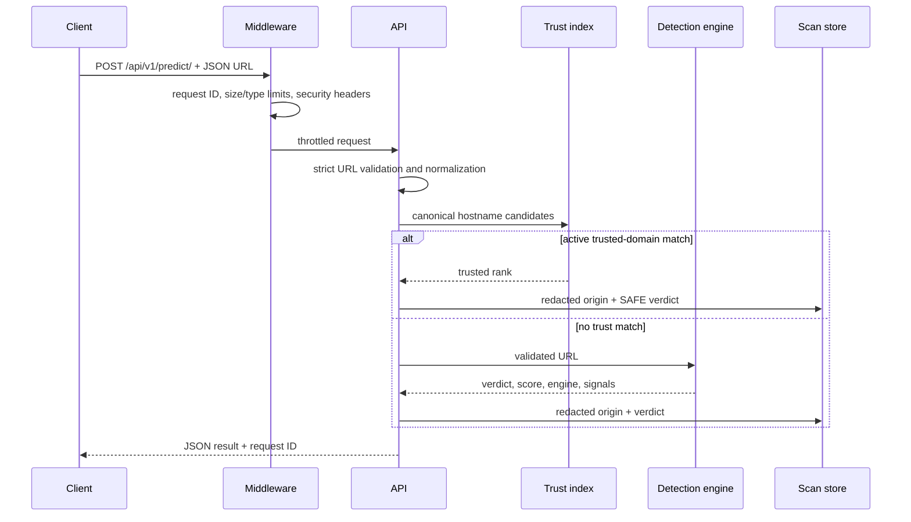

# System architecture

## Purpose and scope

PhishGuard is a URL-risk decision-support service. It validates an arbitrary
HTTP(S) URL, checks canonical domain trust data, evaluates explainable lexical
and structural signals, optionally combines a qualified ML model, stores a
privacy-reduced scan record, and returns a structured verdict.

PhishGuard does not open the submitted page, download its content, execute its
scripts, or claim that a low lexical score proves a site is safe.

## Runtime topology

The checked-in Compose stack represents this topology locally without the TLS
edge. It binds the web service to loopback and does not expose database or cache
ports. Hosted environments must provide the omitted edge controls.

## Request path

For non-whitelisted analysis, a temporary scan-log write failure is logged but
does not discard an already-computed verdict. Trusted-domain decisions still
depend on database availability and are covered by the readiness probe.

## Application components

| Component | Responsibility |
| --- | --- |
| `backend/settings.py` | Environment contract, databases, cache, security and framework configuration |
| `api/middleware.py` | Request IDs, request limits, response cache controls and browser security headers |
| `api/serializers.py` | Input validation, hostname extraction, and storage redaction |
| `api/domains.py` | Canonical hostname and public-suffix-aware trust candidates |
| `api/ml_logic.py` | Explainable rule scoring and optional hybrid model combination |
| `api/views.py` | API orchestration, permissions, audit creation and scan persistence |
| `api/dashboard.py` | Short-lived aggregate cache and query-efficient statistics |
| `browser-extension/` | Manifest V3 popup client for active-tab and pasted-URL analysis |
| `api/models.py` | Trusted domains, immutable audit history, and privacy-reduced scan records |
| `backend/health.py` | Liveness and database/cache readiness probes |
| `ml_pipeline/` | Reproducible candidate training and external evaluation workflow |

## Data model and classification

| Record | Stored fields | Classification | Retention |
| --- | --- | --- | --- |
| Scan log | normalized origin, verdict, confidence, optional resolved IP/country, timestamp | operationally sensitive | 30 days by default |
| Trusted domain | canonical ASCII hostname and active rank | internal configuration | until administratively changed |
| Trust audit event | domain, action, actor identity snapshot, reason, request ID, timestamp | security audit | retain according to institutional policy |

For scan logs, the origin contains only scheme, hostname, and explicit port.
Paths, queries, fragments, and credentials are removed before persistence.
Recent target domains are hidden from anonymous dashboard users.

The browser extension is a separate presentation client. It reads the current
tab only after the user invokes the toolbar action and sends the selected URL
to the existing versioned prediction endpoint. It has no content script or
background service worker and does not alter visited pages.

## Detection decision

1. Strict parsing accepts only complete HTTP or HTTPS URLs with valid hosts.
2. Canonical trust candidates are checked against active trusted domains.
3. Otherwise, independent URL-structure rules produce a risk score and reasons.
4. If a validated model is explicitly enabled, its probability is combined
   with the rule score using the configured weight.
5. A score at or above the configured threshold is `PHISHING`.
6. Rules-only analysis below the threshold is `UNKNOWN`, not `SAFE`, because
   absence of a lexical signal is not proof of safety.

The historical CNN and current candidate remain disabled; their limitations
and evaluation evidence are recorded in the model cards.

## Availability and scaling

- Gunicorn uses bounded worker/thread counts and worker recycling.
- PostgreSQL connections are reused with health checks.
- Redis shares throttling state and dashboard aggregates across web replicas.
- Liveness tests the process; readiness tests database and cache dependencies.
- Database migrations run once before web startup in the Compose stack.
- Dashboard aggregates use two database queries and a short, invalidated cache.

Application throttling protects fair resource use. An edge proxy or hosting
platform must provide connection limits, request timeouts, and DDoS controls.

## Related documents

- [Threat model](threat-model.md)
- [Testing strategy](testing.md)
- [Operations runbook](operations.md)
- [Release checklist](release-checklist.md)
- [ML evaluation workflow](../ml_pipeline/README.md)
